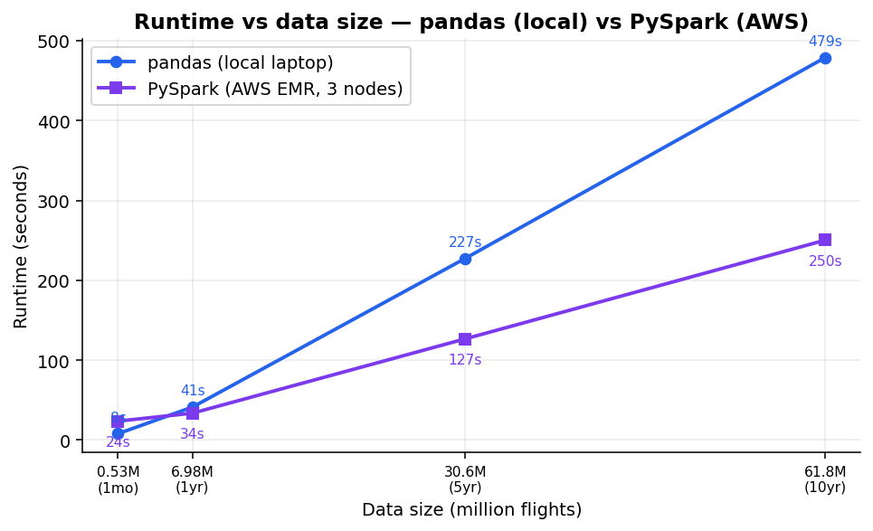

<h1 align="center">US Flight Delay Analysis: one laptop vs. a Spark cluster</h1>

  62 million flights. pandas on one machine versus PySpark on AWS, doing the same analysis.
  At what point does "just use a bigger machine" stop working?

  

  
  
  

## Introduction

A group study for IST3134 Big Data Analytics. The question: over 2015 to 2024, which airports,
routes, carriers, and times of day had the worst US flight delays, and how did the mix of delay
causes shift across the decade? We ran the exact same group-by / map-reduce analysis two ways,
pandas on a single machine and PySpark on a cluster, to find the point where one machine stops
being enough.

## The headline result

At the full 10-year scale (~62M rows):

- **pandas on one machine** needed **38.4 GB of memory** and **479 seconds**.
- **PySpark on a 3-node AWS EMR cluster** finished in **250 seconds**, within a bounded ~12 GB per
  container.

Same algorithm both ways. As the data grows, the single machine hits a memory wall the
distributed platform does not, which is exactly when the cluster earns its keep.

## What's in the repo

- **`Code/`** – Jupyter notebooks: `01..04` pandas baseline, `05..08` PySpark local
- **`AWS/`** – Spark jobs for EMR (`2_spark_emr.py`, `3_spark_scaling.py`)
- **`Output/`** – result tables, charts, and the pandas-vs-Spark comparison figures
- **`IST3134_Report.pdf`** – the full written report

## The dataset

US Bureau of Transportation Statistics, "Reporting Carrier On-Time Performance", free from
[transtats.bts.gov](https://www.transtats.bts.gov). 120 monthly files for 2015 to 2024, ~62M
flights, ~110 columns. The raw data is not in this repo (too large for GitHub); download the
monthly files from the source.

## Reproduce it

1. Download the monthly files into `Data/Raw/` (and to an S3 bucket for the AWS run).
2. **Local pandas:** open `Code/0x_local_*` and Run All (`pip install pandas matplotlib`).
3. **Local Spark:** open `Code/0x_spark_*` (`pip install pyspark pandas matplotlib`, Java 17).
4. **Cloud Spark:** create an EMR cluster, upload `AWS/3_spark_scaling.py` to S3, run it as a
   Spark step with the bucket name as the argument.
